# 02. Typescript

Praktikum - Bagian 1:Instalasi Typescript
---

* Buat folder ts-hello

* Buat file main.ts

* Buat file main.ts

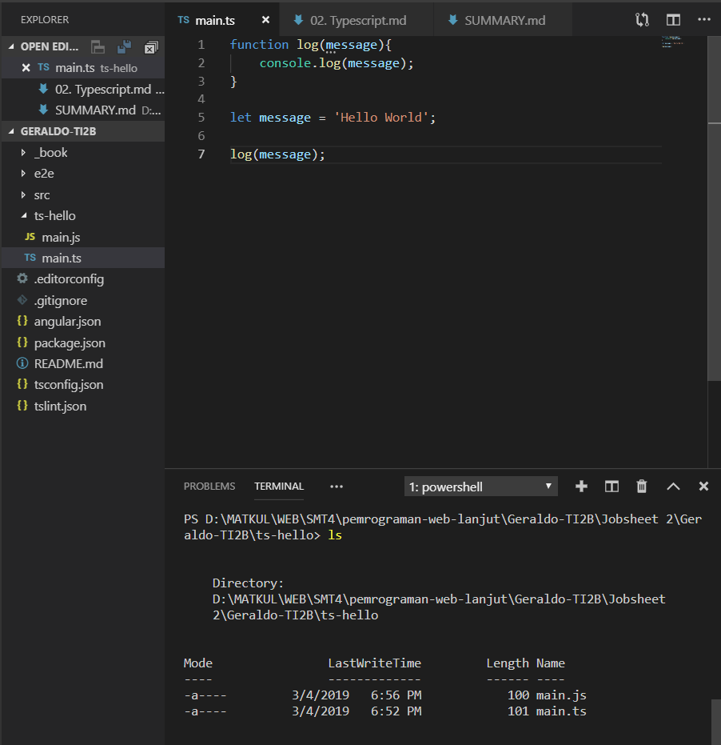

* Apakah sama isi dari file main.ts dan main.js	?

* Beda di main.js menggunakan var

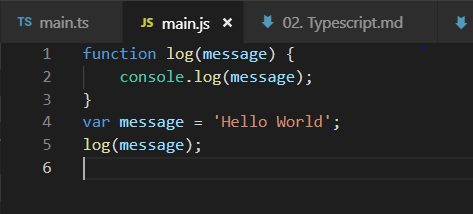

* Hasil main.js

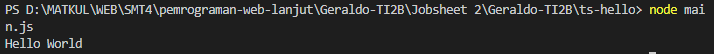

Praktikum – Bagian 2: Declaring Variables
---

* Merubah main.ts

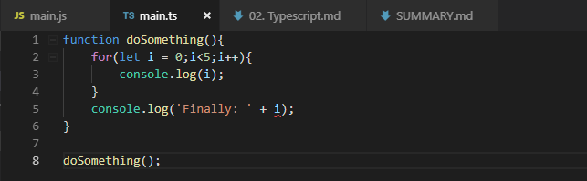

* Menghapus main.js

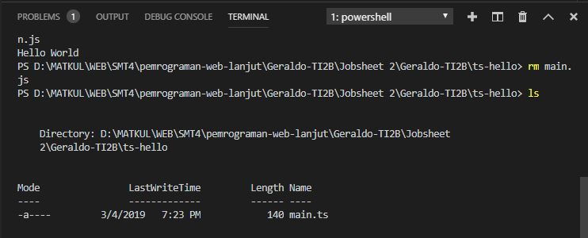

* Transpile main.ts

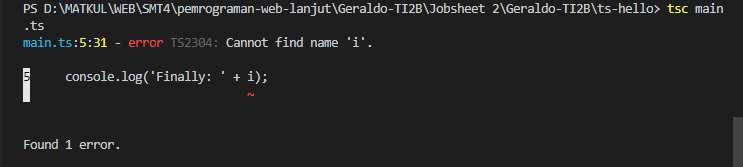

* Hasil main.js

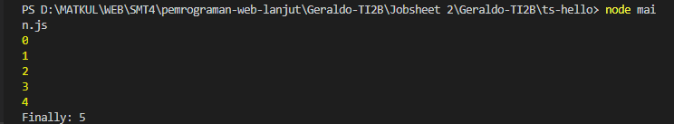

Praktikum - Bagian 3: Types
---

* main.ts

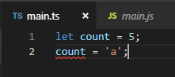

* main.js

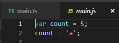

Praktikum – Bagian 4: Type Assertion
---

* main.ts

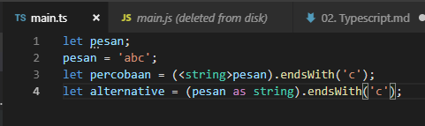

* Hasil main.js

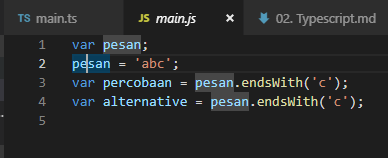

Praktikum – Bagian 5: Arrow Function
---

* main.ts

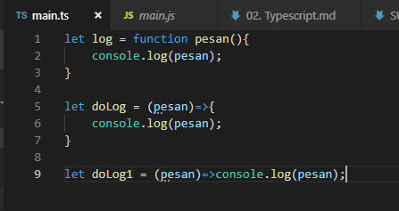

Praktikum – Bagian 6: Interface
---

* main.ts

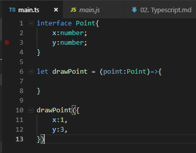

Praktikum – Bagian 7: Classes
---

* main.ts

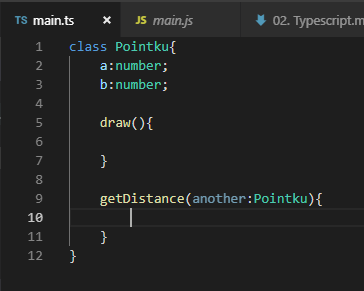

Praktikum – Bagian 8: Objects
---

* main.ts

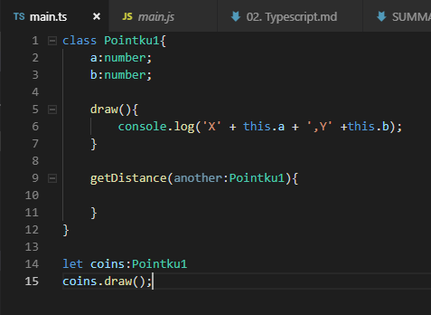
