# 03. Angular Fundamental

Praktikum – Bagian 1: Component Basic
---

* Membuat component dengan nama courses

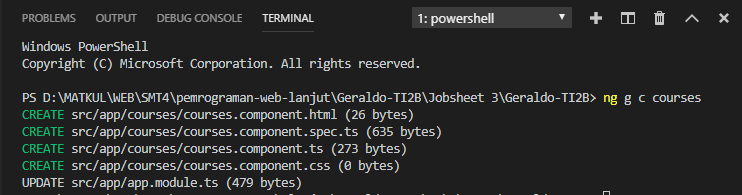

* Hasil

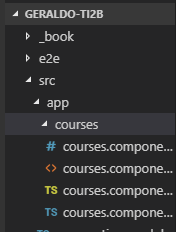

*  Merubah file app.component.html, lakukan modifikasi code nya menjadi seperti berikut :

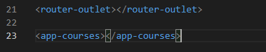

* Hasil

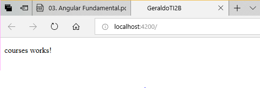

* Buka file app.modules.ts dan hapus coursecomponent pada declarations

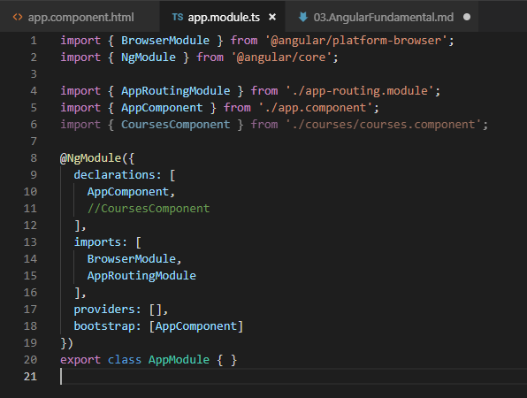

* Hasil

* Terdapat error bahwa app-courses tidak diketahui

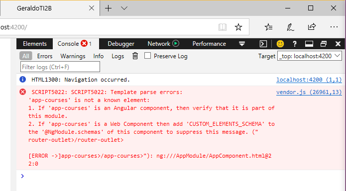

Praktikum – Bagian 2: Templates
---

* Tambahkan property baru dengan nama title

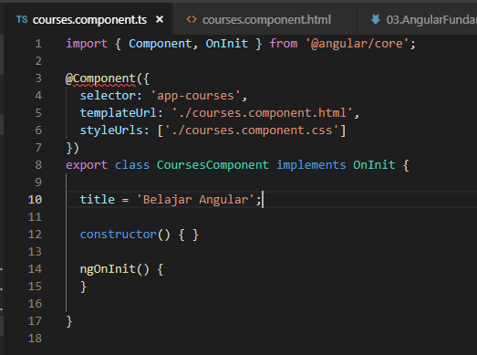

* Tambahkan seperti berikut

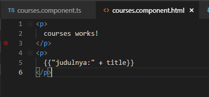

* Hasil

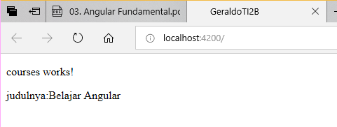

* Membuat method getTitle

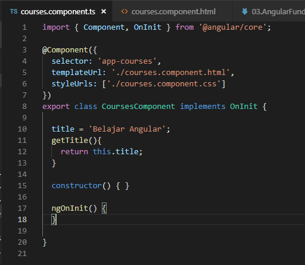

* Melakukan modifikasi

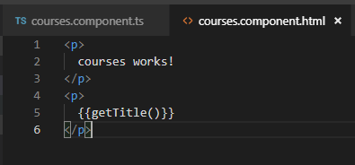

* Hasil

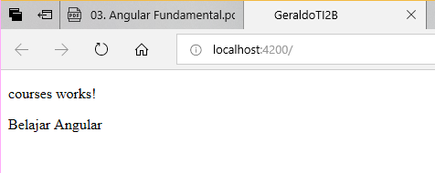

Praktikum - Bagian 3: Directive
---

* Membuat property array dengan nama Course

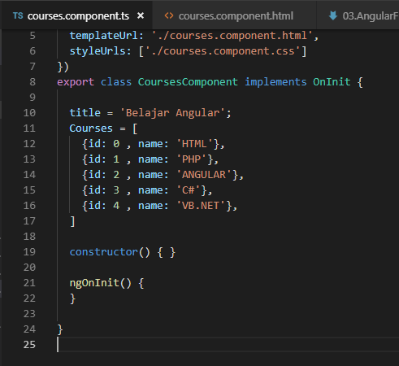

* Menambahkan directive ngFor dan string interpolation

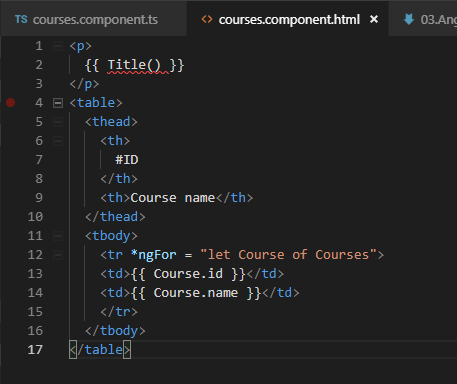

* Hasil

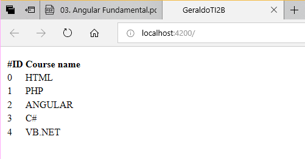

Praktikum – Bagian 4: Services dan Dependency Injection
---

* service baru yang bernama courses

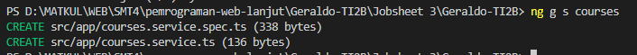

* Menambahkan method getCourse

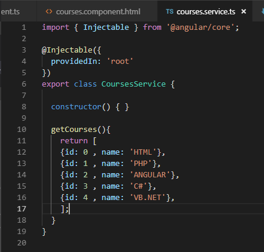

* Memodifikasi courses.component.ts

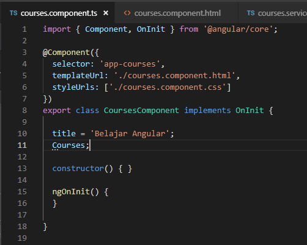

* Menambahkan constructor

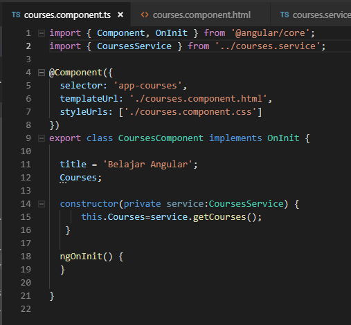

* Hasil

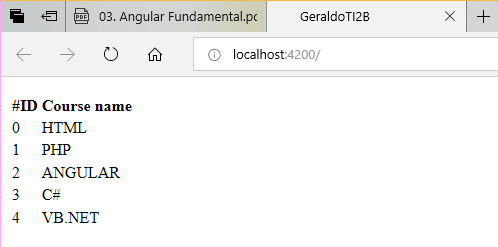
