# 04. Displaying Data And Handling Event

Praktikum – Bagian 1: Component Basic
---

* Menambahkan code di file courses.component.ts

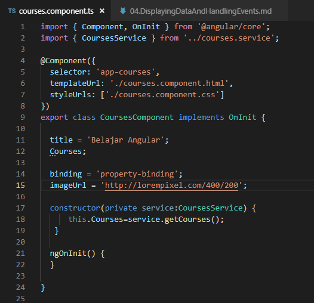

* Menambahkan code di file courses.component.html

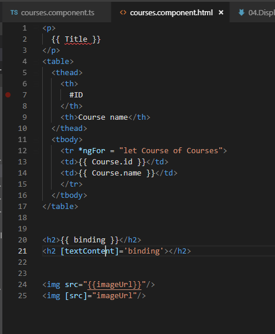

* Hasil Property Binding

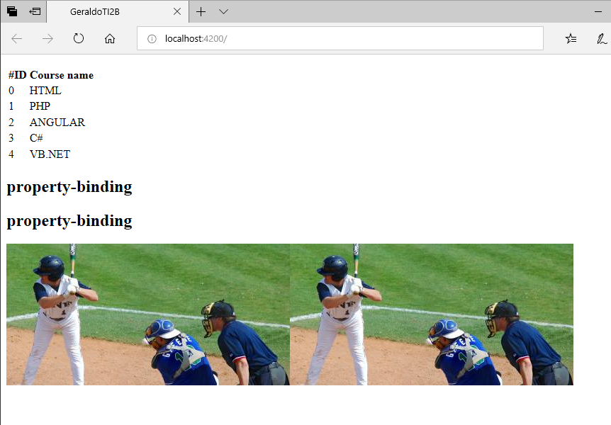

Praktikum – Bagian 2: Attribute Binding
---

* Menambahkan code di file courses.component.ts

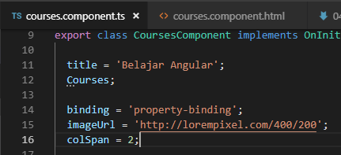

* Menambahkan code di file courses.component.html

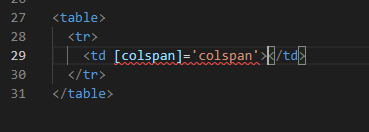

* Hasil nya error karena colspan bukan property td

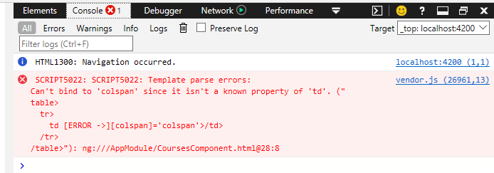

* Menambahkan attr pada colspan

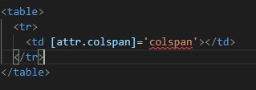

* Hasil dari menambahkan attr

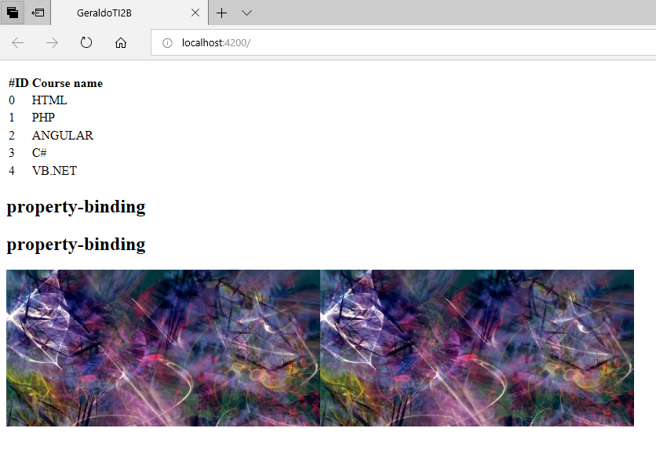

* Menambahkan button 

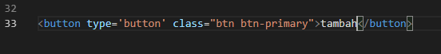

* Hasil setelah menambahkan button

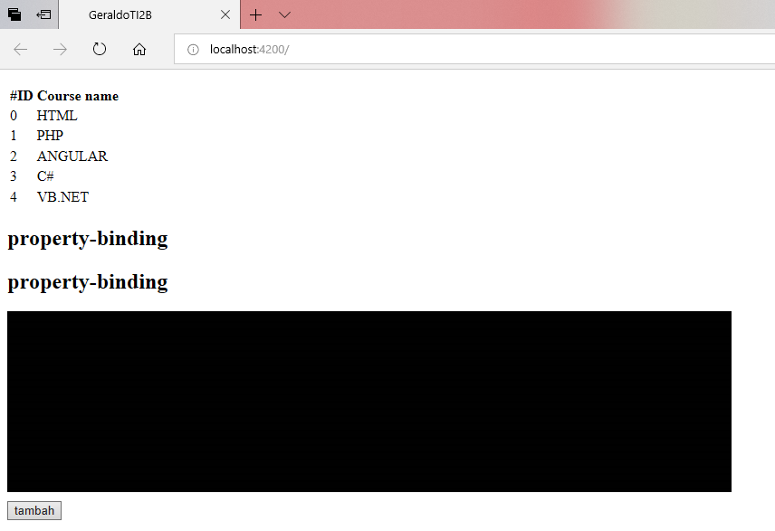

Praktikum - Bagian 3: Class Binding
---

* Menambahkan property isActive = true ; 

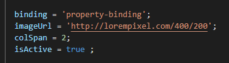

* Menambahkan class binding

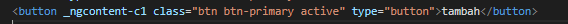

* Merubah isActive menjadi false

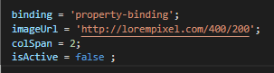

Praktikum – Bagian 4: Style Binding
---

* Menambahkan code di button

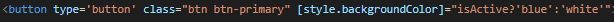

* Hasil button akan berwarna biru 

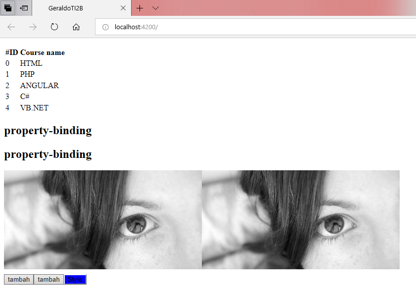

Praktikum – Bagian 5: Event Binding
---

* Membuat method dengan nama onSave()

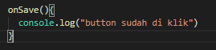

* Menambahkan event click pada button

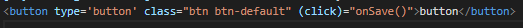

* Hasil 

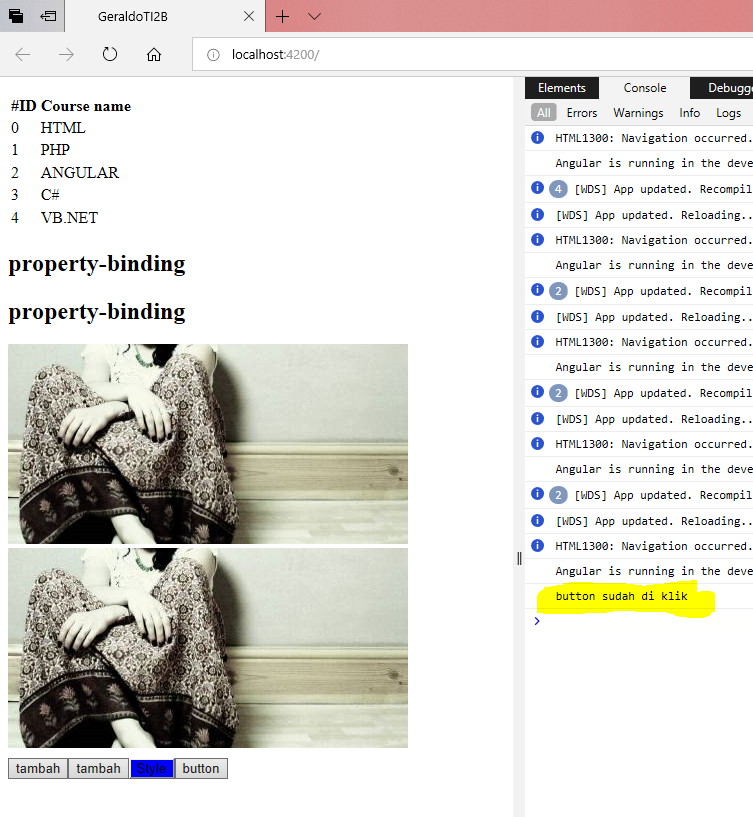

>Penjelasan : jika button di click maka akan muncul tulisan pada console " button sudah di klik "

* Menambahkan paramater $event pada method onSave

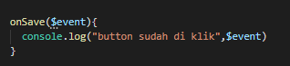

* Menambahkan parameter $event pada button

* Hasil 

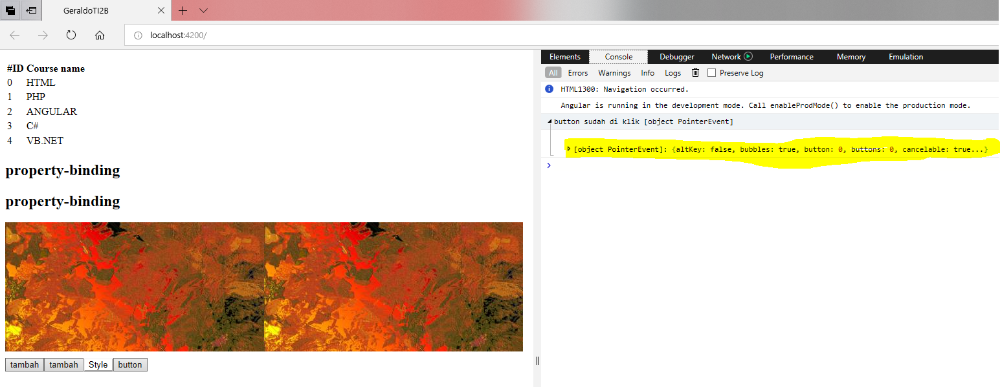

>Penjelasan : jika button di click muncul tulisan pada console " button sudah di klik [object PointerEvent] "

* menambahkan method onDivClick()

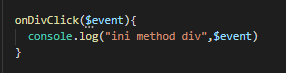

* Menambahkan event binding pada div elemen

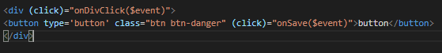

* Hasil akan muncul tulisan ini method div pada console

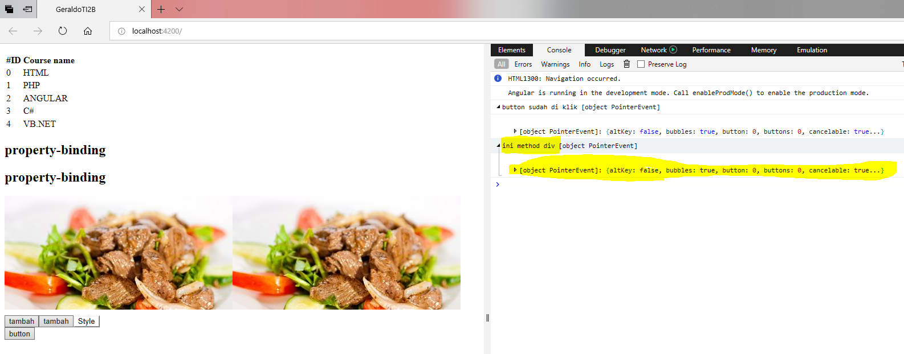

* Menambahkan code $event.stopPropagation pada method onSave

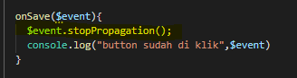

* Hasil

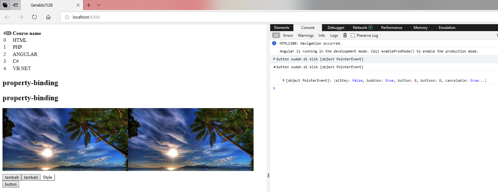

> Penjelasan: Kegunaan dari stopPropagation() adalah untuk mengatasi terjadinya pengenalan pada event method selanjutnya (hanya pada parent method).

Praktikum – Bagian 6: Event Filtering
---

* Menambahkan inputan

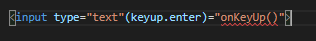

* Menambahkan method onKeyUp

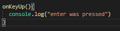

* Hasil

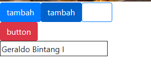

* Setelah di tekan enter

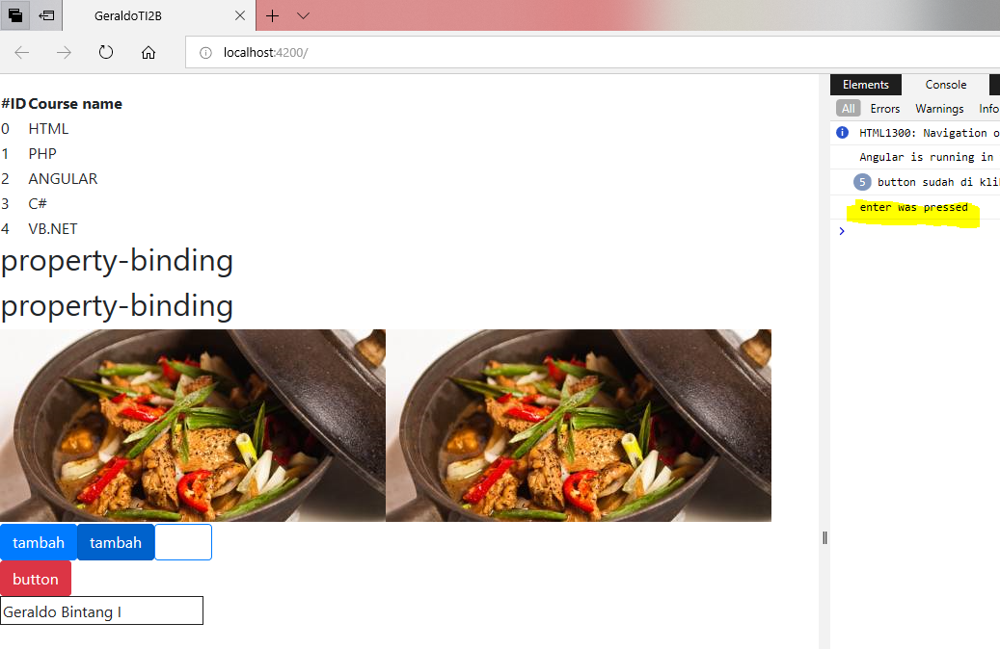

Praktikum – Bagian 7: Template Variable
---

* Menambahkan variable nama 

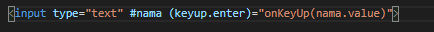

* Menambah parameter nama pada method onKeyUp

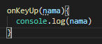

* Hasil 

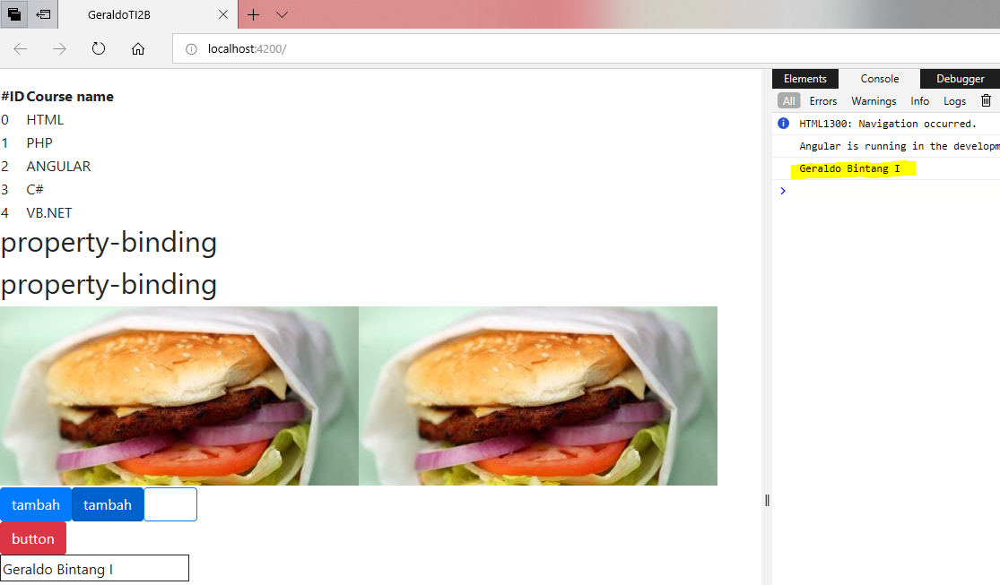

>Penjelasan : jika kita mengetikkan nama kita pada input lalu kita tekan enter akan muncul nama kita pada console

Praktikum – Bagian 8: Two Way Binding
---

* Menambahkan property dengan nama kita masing-masing

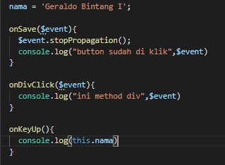

* Menambahkan parameter nama pada method onKeyUp

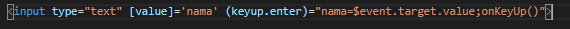

* Hasil 

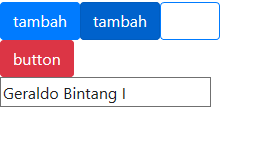

>Penjelasan : Pada kolom input sudah ada nama kita sesuai property nama

* Menambahkan formsmodule

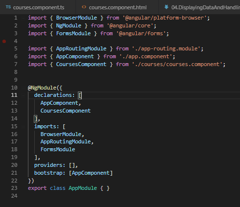

* Memodifikasi code input

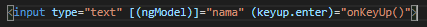

* Hasil

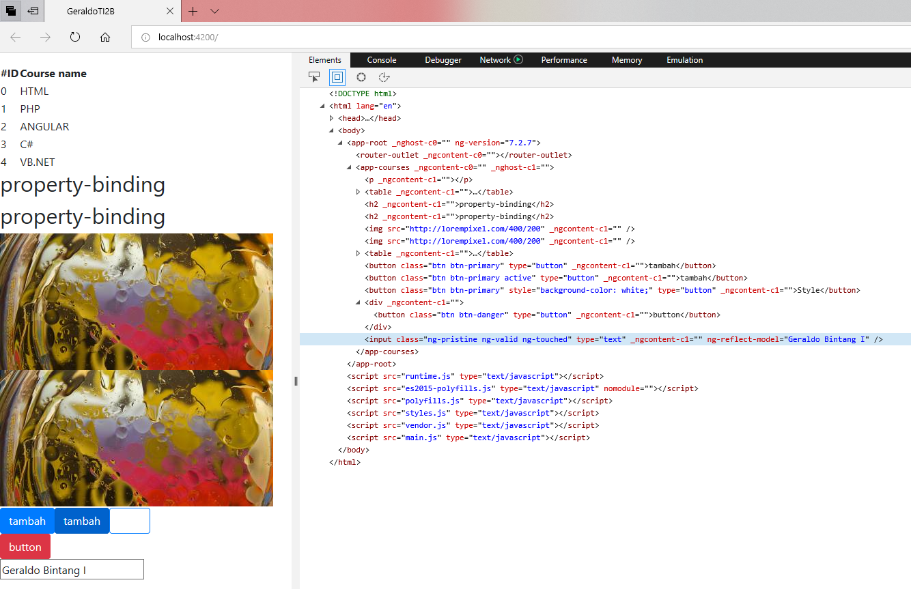

>Penjelasan : Untuk soal 11 dan 12 perbedaannya adalah pada soal 11 tidak terdapat ng-reflect-model, sedangkan 12 ada ng-reflect-model yang mana kolom tersebut sudah menjadi FormControl.