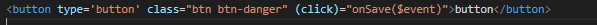

# 04. Displaying Data And Handling Event

Praktikum – Bagian 1: Component Basic
---

* Menambahkan code di file courses.component.ts

* Menambahkan code di file courses.component.html

* Hasil Property Binding

Praktikum – Bagian 2: Attribute Binding
---

* Menambahkan code di file courses.component.ts

* Menambahkan code di file courses.component.html

* Hasil nya error karena colspan bukan property td

* Menambahkan attr pada colspan

* Hasil dari menambahkan attr

* Menambahkan button 

* Hasil setelah menambahkan button

Praktikum - Bagian 3: Class Binding
---

* Menambahkan property isActive = true ; 

* Menambahkan class binding

* Merubah isActive menjadi false

Praktikum – Bagian 4: Style Binding
---

* Menambahkan code di button

* Hasil button akan berwarna biru 

Praktikum – Bagian 5: Event Binding
---

* Membuat method dengan nama onSave()

* Menambahkan event click pada button

* Hasil 

>Penjelasan : jika button di click maka akan muncul tulisan pada console " button sudah di klik "

* Menambahkan paramater $event pada method onSave

* Menambahkan parameter $event pada button

* Hasil 

>Penjelasan : jika button di click muncul tulisan pada console " button sudah di klik [object PointerEvent] "

* menambahkan method onDivClick()

* Menambahkan event binding pada div elemen

* Hasil akan muncul tulisan ini method div pada console

* Menambahkan code $event.stopPropagation pada method onSave

* Hasil

> Penjelasan: Kegunaan dari stopPropagation() adalah untuk mengatasi terjadinya pengenalan pada event method selanjutnya (hanya pada parent method).

Praktikum – Bagian 6: Event Filtering
---

* Menambahkan inputan

* Menambahkan method onKeyUp

* Hasil

* Setelah di tekan enter

Praktikum – Bagian 7: Template Variable
---

* Menambahkan variable nama 

* Menambah parameter nama pada method onKeyUp

* Hasil 

>Penjelasan : jika kita mengetikkan nama kita pada input lalu kita tekan enter akan muncul nama kita pada console

Praktikum – Bagian 8: Two Way Binding
---

* Menambahkan property dengan nama kita masing-masing

* Menambahkan parameter nama pada method onKeyUp

* Hasil 

>Penjelasan : Pada kolom input sudah ada nama kita sesuai property nama

* Menambahkan formsmodule

* Memodifikasi code input

* Hasil

>Penjelasan : Untuk soal 11 dan 12 perbedaannya adalah pada soal 11 tidak terdapat ng-reflect-model, sedangkan 12 ada ng-reflect-model yang mana kolom tersebut sudah menjadi FormControl.